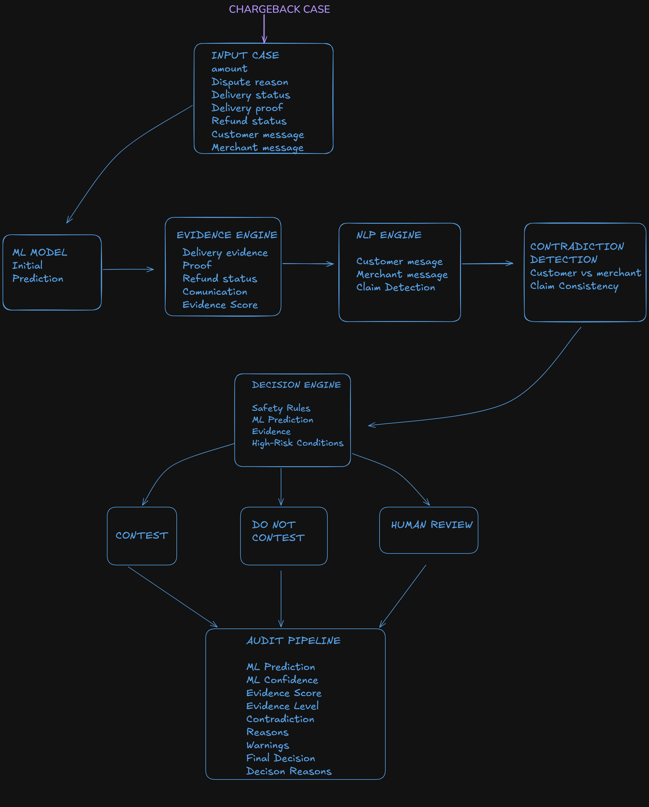

\# ChargebackGuard AI


\*\*AI-Powered Chargeback Decision Support System\*\*


ChargebackGuard AI is a defense-only AI system that helps merchants analyze payment disputes by combining machine learning, evidence analysis, NLP-based communication analysis, contradiction detection, and deterministic safety rules.


The system is designed as a \*\*decision-support tool\*\*, not an autonomous payment decision-maker. High-risk, contradictory, or insufficiently supported cases can be routed to human review.


\## Problem


When a merchant receives a chargeback, relevant information may be distributed across:


\* Payment records

\* Order information

\* Delivery status

\* Delivery proof

\* Refund status

\* Customer communication

\* Merchant communication


Manually reviewing these signals can be time-consuming and may result in inconsistent decisions or overlooked evidence.


\## Solution


ChargebackGuard AI analyzes a dispute through a multi-stage decision pipeline.


The system:


1\. Generates an ML-based prediction

2\. Analyzes objective transaction and delivery evidence

3\. Extracts relevant signals from customer and merchant messages

4\. Detects contradictory evidence

5\. Applies deterministic safety rules

6\. Produces one of three final decisions:


&#x20;  \* `CONTEST`

&#x20;  \* `DO\_NOT\_CONTEST`

&#x20;  \* `HUMAN\_REVIEW`


The final decision is deliberately separated from the ML prediction so that safety rules can override an unsafe or insufficiently supported ML output.


\## System Architecture





\## Decision Philosophy


The system follows a safety-first approach.


\### CONTEST


A dispute can be automatically contested when strong objective delivery evidence supports the merchant's position and no higher-priority safety condition prevents the decision.


\### DO\_NOT\_CONTEST


A dispute is not automatically contested when the available evidence indicates that the merchant does not have sufficient grounds to contest the chargeback.


\### HUMAN\_REVIEW


Cases requiring additional verification are escalated instead of being automatically decided.


Examples include:


\* Unauthorized transactions

\* Duplicate charges

\* Product-not-as-described disputes

\* Contradictory customer and merchant statements

\* Missing or insufficient dispute information

\* Unknown or unreliable ML predictions


\## AI Components


\### Machine Learning


The ML model provides an initial classification of the dispute:


\* `CONTEST`

\* `DO\_NOT\_CONTEST`

\* `HUMAN\_REVIEW`


The ML prediction is treated as a signal rather than the final authority.


\### Evidence Analysis


The evidence engine evaluates objective signals such as:


\* Delivery status

\* Delivery proof

\* Refund status

\* Dispute reason

\* Communication evidence


\### NLP Analysis


Customer and merchant messages are analyzed for relevant dispute signals, including non-receipt claims and delivery/receipt confirmations.


\### Contradiction Detection


The system identifies conflicting evidence, such as a customer currently claiming non-receipt while previous communication indicates that the customer confirmed receipt.


Contradictory cases are routed to `HUMAN\_REVIEW`.


\### Safety Rules


Deterministic rules provide an additional safety layer around the ML model.


For example:


\* Refund already issued → `DO\_NOT\_CONTEST`

\* Unauthorized transaction → `HUMAN\_REVIEW`

\* Duplicate charge → `HUMAN\_REVIEW`

\* Strong delivery evidence → eligible for `CONTEST`

\* Contradictory evidence → `HUMAN\_REVIEW`


\## Validation Results


The complete pipeline was evaluated on a \*\*held-out dataset containing 150 cases\*\*.


\### ML Model


| Metric            |    Result |

| ----------------- | --------: |

| Accuracy          |   \*\*88%\*\* |

| CONTEST Precision |   \*\*52%\*\* |

| CONTEST Recall    | \*\*73.7%\*\* |

| CONTEST F1        |   \*\*61%\*\* |


The ML model alone produces some incorrect `CONTEST` predictions, demonstrating why the safety layer is necessary.


\### Final Safety Pipeline


| Metric                         |   Result |

| ------------------------------ | -------: |

| Accuracy                       | \*\*100%\*\* |

| CONTEST Precision              | \*\*100%\*\* |

| CONTEST Recall                 | \*\*100%\*\* |

| Automatic CONTEST cases        |   \*\*19\*\* |

| Automatic DO\_NOT\_CONTEST cases |   \*\*39\*\* |

| HUMAN\_REVIEW cases             |   \*\*92\*\* |


The final pipeline achieved 100% accuracy on the project's 150-case held-out evaluation dataset.


\## Safety Audit


The pipeline includes additional adversarial and edge-case validation.


\### Adversarial Testing


\*\*10 / 10 tests passed\*\*


Tested scenarios include:


\* Strong delivery evidence

\* ML prediction conflicting with strong evidence

\* Customer/merchant contradiction

\* Delivery failure

\* Refund already issued

\* Unauthorized transaction

\* Duplicate charge

\* Product not as described

\* Weak evidence


\### Edge-Case Testing


\*\*10 / 10 tests passed\*\*


Tested scenarios include:


\* Delivery proof with failed delivery

\* Delivered order without proof

\* Refund issued despite strong delivery

\* Contradictory evidence

\* Unknown ML prediction

\* Missing dispute reason

\* Description dispute

\* Unauthorized transaction with delivery proof

\* Duplicate charge with delivery proof

\* Uppercase input fields


\### Pipeline Audit


The audit verifies that:


\* Every automatic `CONTEST` has strong objective delivery evidence

\* No automatic `CONTEST` was produced without strong delivery evidence

\* Ground-truth labels are not used by the decision engine

\* Safety rules can override ML predictions

\* High-risk cases can be routed to human review


Current audit result:


```text

AUDIT STATUS: PASS

Automatic contest safety: PASS

Ground-truth leakage check: PASS

```


\## Example Decisions


\### Strong Delivery Evidence


```text

ML Prediction: HUMAN\_REVIEW

Evidence Score: 100 / 100

Final Decision: CONTEST


Reason:

Strong objective delivery evidence supports contesting.

```


The safety layer can override an ML `HUMAN\_REVIEW` prediction when the evidence satisfies the project's contesting criteria.


\### Delivery Failure


```text

ML Prediction: DO\_NOT\_CONTEST

Evidence Score: 41 / 100

Final Decision: DO\_NOT\_CONTEST


Reason:

Delivery failed and supports the non-receipt claim.

```


\### Contradictory Evidence


```text

ML Prediction: HUMAN\_REVIEW

Evidence Score: 100 / 100

Final Decision: HUMAN\_REVIEW


Reason:

Conflicting evidence detected.

```


\### Unauthorized Transaction


```text

ML Prediction: HUMAN\_REVIEW

Evidence Score: 90 / 100

Final Decision: HUMAN\_REVIEW


Reason:

Unauthorized transaction requires verification.

```


\### Duplicate Charge


```text

ML Prediction: HUMAN\_REVIEW

Evidence Score: 90 / 100

Final Decision: HUMAN\_REVIEW


Reason:

Duplicate charge requires transaction verification.

```


\## Technology Stack


\* Python

\* Scikit-learn

\* NLP / text analysis

\* Pandas

\* Streamlit

\* Machine Learning

\* Rule-based decision engine


\## Project Structure


```text

ChargebackGuardAI/

│

├── app.py

├── chargeback\_guard.py

│

├── decision\_engine.py

├── evidence\_engine.py

├── nlp\_engine.py

│

├── train\_model.py

├── evaluate\_model.py

├── evaluate\_pipeline.py

├── pipeline\_audit.py

├── final\_validation.py

│

├── adversarial\_tests.py

├── edge\_case\_tests.py

├── inspect\_missed.py

├── error\_analysis.py

│

├── data/

│   ├── raw/

│   ├── processed/

│   └── test/

│

├── models/

│   └── chargeback\_model.pkl

│

├── tests/

│   ├── test\_decision\_engine.py

│   ├── test\_evidence\_engine.py

│   ├── test\_nlp\_engine.py

│   └── test\_pipeline.py

│

├── requirements.txt

└── README.md

```


\## Running the Application


Create and activate the virtual environment:


```powershell

python -m venv venv

.\\venv\\Scripts\\Activate.ps1

```


Install dependencies:


```powershell

pip install -r requirements.txt

```


Run the Streamlit application:


```powershell

streamlit run app.py

```


The application will open in the browser and provide an interface for analyzing chargeback disputes.


\## Running Validation


Run the complete validation suite:


```powershell

python final\_validation.py

```


The validation pipeline runs:


```text

Adversarial Tests

&#x20;      ↓

Edge-Case Tests

&#x20;      ↓

Pipeline Evaluation

&#x20;      ↓

Pipeline Audit

```


Expected final result:


```text

FINAL STATUS: PASS

```


\## Safety Notice


ChargebackGuard AI is a \*\*decision-support system\*\*.


It does not directly perform payment reversals, submit chargeback responses to financial networks, or make irreversible financial decisions.


The system is designed to surface evidence, apply safety constraints, and assist a human reviewer in making a better-informed decision.


\## Project Status


\*\*Validated prototype / working project\*\*


The current implementation has passed the project's adversarial tests, edge-case tests, held-out pipeline evaluation, and safety audit.


